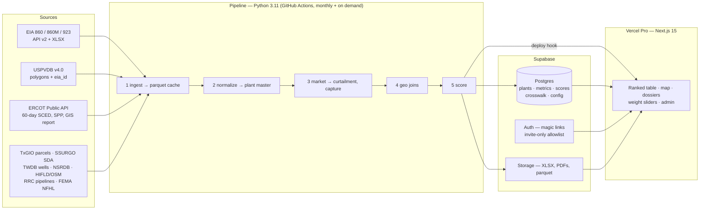

# Texas PV-to-Datacenter Screen — Build Plan v2 (with Vercel front end)

**Prepared for:** Cristobal / Smart Investments
**Supersedes:** `texas-pv-to-datacenter-screen-brief.md` §4, §7, §8 (build order, deliverables). §1–§3, §5–§6 of the brief stand except where amended below.
**Date:** 1 September 2026
**Decisions recorded (1 Sep 2026):** invite-only magic-link login for outside users · Supabase backend · monthly refresh on GitHub Actions · code pushed to a new GitHub repo under `cristobal-ai`, linked to Vercel.

---

## 1. What changes, in one page

The brief is sound on thesis and scoring. The adjustments below are about (a) using three datasets the brief did not know about that remove the hardest work, (b) one regulatory fact that changes the tier boundaries, and (c) restructuring the deliverables so the Vercel app is the product rather than an afterthought.

| # | Change | Why | Effect on effort |
|---|---|---|---|
| 1 | **Anchor the plant master on USGS/LBNL USPVDB v4.0 (April 2026), not on EIA-860M alone.** | It is a georeferenced polygon database of every ground-mounted PV plant ≥1 MW in the US, with `eia_id` already attached, plus array area (`p_area`), AC/DC capacity, tracking axis, primary module technology and year. That is the acreage filter (§2 filter 4), the acres/MW score (§5C) and the array footprint for "expansion headroom" delivered in one file. | Removes most of Phase 4 parcel work; gives a polygon centroid to seed the EIA↔ERCOT crosswalk. |
| 2 | **Replace the 12 county-CAD scrapes with TxGIO StratMap statewide parcels.** | Free, standardized schema (owner, land use, appraised value, acreage), shapefile/GDB, refreshed roughly annually per county. Intersect parcel polygons with the USPVDB array polygon → parcel acreage − array area = expansion headroom as a computed number, and same-owner adjacency = "unified land control". | Turns §5C from judgment calls into arithmetic. |
| 3 | **Take POI voltage from EIA-860 (generator file, `Grid Voltage (kV)`), not from the ERCOT GIS report.** | The GIS report only carries projects still in the queue or recently commercial; 2015–2019 CODs have aged out. EIA-860 reports interconnection voltage for every generator. Keep the GIS report for POI substation names on newer plants. | Removes a data gap for the exact vintage window the thesis targets. |
| 4 | **Add an SB6 large-load flag and align tier boundaries to the 75 MW load line.** | SB6's large-load standards and the co-location review apply at **≥75 MW of load**. At the brief's 0.5 MW IT per MWdc, a PUE of 1.15 and ILR 1.30, 75 MW of facility load ≈ 65 MW IT ≈ 130 MWdc ≈ **100 MW AC**. Plants above ~100 MW AC produce an SB6-jurisdictional load at full build; everything below can be designed to stay under it. On 24 July 2026 the PUCT approved the first SB6 net-metering arrangement (Docket 59220) and held that emergency curtailment of a co-located load is **not capped at the paired generator's capacity**, with a 30-minute full-disconnect obligation and no ancillary-services participation. | Split T1 into T1a (75–100 MW AC, sub-75 MW load possible) and T1b (>100 MW AC, SB6 review path). Add `sb6_review_required` and `planned_load_mw` to every plant. |
| 5 | **Calibrate the capture-rate and curtailment cut points to the actual ERCOT PV fleet distribution, not to the 57%/72% benchmark.** | I could not verify the H1-2025 benchmark figures from a primary source (the Modo Energy analysis is gated; it does confirm >8 TWh of ERCOT wind+solar curtailment in 2024). Compute capture rate for every plant first, then set the 12/8/4/0 breakpoints at fleet quartiles. Expose both the quartile and the fixed thresholds in `config`. | No extra effort; avoids anchoring the score to a number we cannot source. |
| 6 | **Accept that EIA-860 cannot tell poly- from mono-crystalline.** | The EIA-860 solar schedule distinguishes crystalline silicon from thin-film types and reports tracking type, tilt and azimuth; it does not carry poly vs mono. Score §5B "polycrystalline" by vintage proxy (COD ≤2018 → likely poly/monofacial; 2019–2020 → mixed; ≥2021 → likely mono-PERC, often bifacial) and flag `module_type_confidence = 'proxy'`. | Keeps 15 points honest; hand-verify on the top 25 from OEM/permit records. |
| 7 | **Downgrade the fiber layer to a proxy and say so.** | FCC's National Broadband Map shows service availability, not long-haul routes; carrier route maps are proprietary. Proxy: distance to nearest interstate / Class I rail right-of-way (where long-haul fiber runs) plus FCC BDC fiber availability at the site. Store `fiber_confidence = 'low'`. | Saves a week of chasing data that is not public. |
| 8 | **Build the web app early (right after the plant master exists), not at the end.** | The app is where the crosswalk gets hand-verified, where weights get tuned live, and where partners see progress. Feeding it phase by phase beats a big-bang launch. | Adds ~3–4 days up front, removes the "rewrite the outputs for the web" step later. |

Smaller fixes: the brief's §5 lists section F before E (cosmetic); the composite arithmetic checks out (A 30 + B 15 + C 20 + D 20 + E 15 = 100, penalty F −15 to 0); add a `data_completeness` percentage per plant that is displayed but never folded into the score, because annual-only EIA-923 reporters and Settlement-Only Generators will have nulls by design.

---

## 2. Fact-check of the brief's assumptions

| Brief assumption | Finding (Sept 2026) | Impact |
|---|---|---|
| 10 MW AC ≈ ERCOT threshold for Generation Resource registration; below it, Settlement-Only Generators lack SCED telemetry. | ERCOT documents the 10 MW line as the categorization threshold (there is a separate INR process for "Generation Resources under 10 MW", i.e. sub-10 MW plants *may* register as a full Resource but are not required to). Assumption holds; treat "≥10 MW ⇒ has Base Point/HSL" as expected, not guaranteed. | Keep filter 1. Add a `sced_coverage` flag rather than assuming. |
| EIA-923 monthly generation exists for all plants. | EIA collects monthly from a sample of ≈1,900 plants and annually from ≈4,050 others (all remaining ≥1 MW). Many T3 and some T2 solar plants will be annual-only. | Brief's own mitigation (`cf_series_resolution = 'annual'`) is correct and must be built, not deferred. |
| Acreage must come from County Appraisal Districts. | USPVDB v4.0 gives the array polygon area directly; TxGIO parcels give parcel acreage and owner statewide (not every county is loaded — check coverage for Pecos, Ward, Andrews, Crane, Concho, Tom Green, Falls, Milam, Hill first). | Changes 1–2 above. |
| POI voltage from ERCOT GIS report. | GIS report drops plants after COD; EIA-860 generator file has grid voltage for all. | Change 3. |
| SB6 "may reshape net metering as early as 2026". | Already happening: PUCT draft rule 16 TAC §25.194 published 12 Mar 2026 (comments closed 17 Apr 2026) sets large-load standards at ≥75 MW with per-MW fees, security and site-study disclosure; PUCT Docket 59220 (24 Jul 2026) approved the first SB6 net-metering arrangement and affirmed uncapped curtailment. Load-queue transparency rules are due from the PUCT by Dec 2026. | Change 4. The 75 MW line is now the most important number in the tiering. |
| Load-pocket proximity can be scored from public data. | ERCOT's large-load queue was 226 GW in Nov 2025 (≈77% data centers) but is published only as monthly TAC/Board status slides with county-level maps, not as a dataset, until the Dec 2026 transparency rule lands. | Score §5D "load-pocket proximity" from a hand-maintained table of announced projects + ERCOT county maps; mark it `manual`. |
| GridStatus wraps the 60-day SCED disclosure. | Confirmed: `gridstatus.ErcotAPI.get_60_day_sced_disclosure(date, end)` returns `sced_gen_resource` with Base Point and HSL; needs ERCOT Public API username/password + subscription key (free). | Phase 3 uses it. Filter to Resource Type `PVGR` before storing. |
| HIFLD transmission lines are on the ArcGIS open-data portal. | The dataset is still catalogued on data.gov and mirrored by the Data Rescue Project after HIFLD Open was restructured; currency is uncertain. | Use the data.gov copy; cross-check 345 kV corridors against OpenStreetMap `power=line` + `voltage` tags for Texas. |
| Vercel is a fine host for a shared tool. | Yes, but the **Hobby plan is non-commercial by policy** and its cron jobs run at most once per day. Pro is **$20/month** (1 deploying seat + $20 usage credit; extra deploying seats $20; viewer seats free). Password Protection is a paid add-on on Pro; Vercel Authentication only admits Vercel team members. | Upgrade the `cristobal-ai's projects` team to Pro before inviting outsiders; do auth in the app (Supabase magic links), not at the Vercel edge. |

---

## 3. Amendments to the brief

### 3.1 Hard filters (§2)
> **Amended 30 Sep 2026 (repo):** USPVDB `p_area` turned out to be array area, not site footprint (Pecos passers run 5.2–8.3 ac/MW on it; Greasewood Solar, 255 MW, fails at 4.9). Until TxGIO parcels are joined in Phase 4, filter 4 on array area sends a plant to `review` instead of dropping it; Phase 4 applies the same 5 ac/MW / 60-acre thresholds to parcel area (`hard_filters.footprint_basis`). Section C acres/MW bands are rescaled then. *Refresh the Claude.ai project copy.*

Filters 1, 2, 3, 5 unchanged. Filter 4 (footprint) is now computed from USPVDB `p_area` (m² → acres) ÷ `p_cap_ac`; keep the 5 acres/MW AC floor and the 60-acre minimum. Add an explicit `ercot_flag` for El Paso Electric and SPP-Panhandle plants (flag, do not drop — per the brief).

### 3.2 Tiers (§2.1)
| Tier | AC capacity | Firm IT (0.5 MW/MWdc, ILR 1.3) | Facility load @ PUE 1.15 | SB6 ≥75 MW load? |
|---|---|---|---|---|
| T1b — Anchor, SB6 path | >100 MW | >65 MW | >75 MW | Yes at full build |
| T1a — Anchor, sub-threshold | 75–100 MW | 49–65 MW | 56–75 MW | Designable below |
| T2 — Mid | 25–75 MW | 16–49 MW | 19–56 MW | No |
| T3 — Modular | 10–25 MW | 6.5–16 MW | 7.5–19 MW | No |

PUE 1.15 is a placeholder for the Komorebi cooling-first design; expose it in `config.yaml` (`pue_assumed`) so the T1a/T1b boundary moves with it.

> **Amended 30 Sep 2026 (repo):** the boundary is computed, not fixed at 100: `75 ÷ (PUE × 0.5 × ILR) = 100.33 MW AC` at current config. A 100.0 MW plant at ILR 1.30 carries 74.75 MW of load, so it is T1a. *Refresh the Claude.ai project copy.*

### 3.3 Data sources (§3)
Add: **USPVDB v4.0** (USGS/LBNL, DOI 10.5066/P9IA3TUS) as the spine of the plant master; **TxGIO StratMap Land Parcels** (free, shapefile/GDB); **EIA-860 generator file** for `Grid Voltage (kV)`; **OpenStreetMap power lines** as the cross-check for HIFLD; **ERCOT Large Load Interconnection Status** monthly reports for the load-pocket layer. Keep everything else. Add `ercot_api` credentials and `nlr_api_key` (NSRDB — NREL was renamed the National Laboratory of the Rockies; `developer.nrel.gov` was retired 29 May 2026, use `developer.nlr.gov`) to the secrets list.

### 3.4 Scoring (§5)
Weights unchanged. Three additions that are displayed, not scored: `sb6_review_required` (bool), `data_completeness` (0–100%), `module_type_confidence` / `fiber_confidence` ('measured' | 'proxy' | 'low'). Breakpoints for capture rate and curtailment become config with two modes: `fixed` (the brief's numbers) and `quantile` (fleet quartiles, recommended default once Phase 3 has run).

### 3.5 Caveats (§6)
Add caveat 6: **SB6 co-location review** — for any plant where `planned_load_mw ≥ 75`, pairing with the existing generator triggers an ERCOT system-impact study (120 days) and a PUCT decision (60 days), with uncapped emergency curtailment of the load and a 30-minute disconnect obligation. Add caveat 7: **tax-equity consent** — CODs from 2019 onward are likely still inside a partnership-flip period; add `tax_equity_consent_likely` (COD ≥ 2019) and keep `itc_recapture_open` (COD after Sept 2021, i.e. within 5 years of today).

### 3.6 Deliverables (§7) — replaced
1. **The web app** at a custom domain (e.g. `screen.smrtinvestments.com`): ranked table with tier filter and live weight sliders; Texas map with plant polygons and the 345 kV / gas / flood layers; one page per plant (the dossier) with print-to-PDF; a methodology page; an admin area for the crosswalk review and the allowlist.
2. **Supabase tables** `plants`, `plant_metrics_monthly`, `plant_scores`, `crosswalk_eia_ercot`, `layers_*`, `users_allowlist`, `score_config` — the database *is* the ranked table.
3. **`ercot_pv_conversion_screen.xlsx`** — generated on demand from the database (Export button) and also written to Supabase Storage by each pipeline run.
4. **`config.yaml`** in the repo, mirrored into `score_config` so weight changes in the UI are versioned.
5. **Methodology note** as a page in the app and as a DOCX/PDF export for lenders and JV partners.
6. **Pipeline outputs** as Parquet in `data/` (raw cache) and Supabase (normalized), with the hand-verified crosswalk persisted in the database and exported to CSV each run.

---

## 4. Target architecture



**Why the pipeline does not run on Vercel.** `geopandas`/`shapely`/SSURGO joins and multi-GB SCED history do not fit serverless functions (300 s max on Hobby, 800 s on Pro) or Hobby's once-a-day cron. GitHub Actions gives 2,000 free minutes/month on a private repo, plenty for one monthly refresh; the first SCED backfill (24–36 months) runs once and is cached to Parquet in Supabase Storage.

**Why Supabase.** One free-tier project covers Postgres, invite-only magic-link auth, and file storage, and it has a Claude connector so the schema can be managed from Cowork. If the free tier's limits bite (about 500 MB database, 1 GB storage, 50k monthly active users — check current pricing), Pro is $25/month. Data volume for this project is small: a few hundred plants × 36 months of metrics is well under 50 MB.

**Web stack.** Next.js 15 (App Router, TypeScript), Tailwind + shadcn/ui, TanStack Table for the ranked grid, MapLibre GL with a free vector basemap for the map (no Mapbox token needed), Recharts for the capacity-factor / capture-rate history, `@supabase/ssr` for auth, `exceljs` for the XLSX export, print stylesheet for dossier PDFs. Vercel Web Analytics on for usage; Vercel Firewall rate limiting on the export endpoint.

**Repo layout** (single repo `cristobal-ai/komorebi-texas-screen`; Vercel "root directory" = `web/`):

```
komorebi-texas-screen/
  pipeline/     # Python: phases 1–5, config.yaml, tests, Pecos validation
  web/          # Next.js app deployed by Vercel
  supabase/     # SQL migrations, seed, RLS policies
  data/         # gitignored raw cache; crosswalk CSV is committed
  .github/workflows/refresh.yml
  docs/methodology.md
```

---

## 5. Build order

Effort is in Cowork working days; elapsed time is longer where waiting on keys. Each phase ends with a named exit check.

| Phase | Scope | Days | Exit check |
|---|---|---|---|
| **0. Accounts & keys** | EIA API key; ERCOT Public API registration (username, password, subscription key); NLR (formerly NREL) developer key for NSRDB; create GitHub repo `cristobal-ai/komorebi-texas-screen`; create Supabase project; upgrade Vercel team to Pro; link repo to Vercel; DNS for `screen.smrtinvestments.com`. | 0.5 (+1–3 elapsed for ERCOT provisioning) | All five secrets stored in GitHub Actions + Vercel env. |
| **1–2. Plant master** | Ingest EIA-860/860M/923 + USPVDB v4.0; join on `eia_id`; apply hard filters; tiers; ILR, net CF (monthly or annual), `cf_series_resolution`, `Grid Voltage (kV)`. | 2–3 | Pecos County plants match by hand (count, MW, COD, acres/MW). Table written to Supabase `plants`. |
| **W1. Web app v0.1** | Scaffold Next.js; Supabase auth with allowlist + magic links; ranked table (unscored yet) with tier filter; map with USPVDB polygons; plant page with the identity block; admin allowlist page. Deploy to Vercel preview; custom domain. | 3–4 | You and one test outsider can log in and browse all filtered plants. |
| **3a. Crosswalk** | Fuzzy match EIA ↔ ERCOT resource names (county + MW + COD + polygon centroid vs. GIS-report POI); write candidates to `crosswalk_eia_ercot` with confidence; **admin review page** in the app to confirm/reject; export CSV each run. | 2–4 | ≥95% of T1/T2 plants confirmed by hand; T3 best-effort. |
| **3b. Market data** | 60-day SCED via GridStatus (PVGR only) → curtailment %; SPP at resource node vs `HB_HUBAVG` (and load-zone hub) → capture rate; 24 months first, extend to 36 after volume is known. Store monthly in `plant_metrics_monthly`. | 3–5 | Fleet capture-rate distribution looks sane (median for standalone West Texas below system average); quartile breakpoints written to `score_config`. |
| **4. Geo layers** (easiest first) | Transmission (HIFLD/OSM, 345 kV distance) → RRC gas pipelines → FEMA NFHL → TxGIO parcels (headroom, ownership) → fiber proxy → NSRDB hours <25 °C → TWDB well logs → SSURGO λ estimate. Each layer is its own script with its own `layers_*` table. | 5–8 | Every layer populated for the Pecos validation set; nulls explained by `data_completeness`. |
| **5. Scoring** | Implement §5 with config in `config.yaml` ↔ `score_config`; sub-scores stored separately; SB6 flag; fixed-cost drag with `firm_it_mw`. Add **weight sliders** to the web app (re-rank client-side from stored sub-scores). | 2–3 | Overall and within-tier rankings render; changing a weight in the UI re-ranks instantly; Pecos plants land where you expect. |
| **6. Dossiers, exports, methodology** | Full plant page (36-month charts, POI, distances, soils/λ, climate, parcels, seven caveat flags with SB6 numbers); print-to-PDF; XLSX export; methodology page + DOCX. | 3–4 | Top-25 dossiers reviewed by you; XLSX opens clean in Excel. |
| **W2. Harden & launch** | RLS policies review; rate limits; error pages; accessibility pass; deploy checklist; GitHub Actions monthly schedule with Slack/email notification on success/failure; invite first outside users. | 2–3 | Deploy checklist signed off; first refresh run completes unattended. |

**Total: roughly 23–35 working days**, front-loaded on data. Phases 3a/3b and 4 can overlap once the plant master is stable.

Validation stays as the brief says: Pecos County first (Komorebi's published planning case). Add one eastern county (Falls or Milam) as a second reference so the capture-rate logic is not tuned only to West Texas congestion.

---

## 6. Connectors and skills to use

**Already connected and used in this plan:** Vercel (deploy, env vars, logs, domain, analytics — I can operate it from here); Google Drive (drop XLSX/PDF exports for partners who will not log in); Slack (pipeline run notifications); Gmail (invitation emails if you prefer to send them yourself); Figma / Canva (optional UI mockups before W1).

**Connect before Phase 0:** **Supabase** (in the Claude connector directory) so I can create tables, policies and storage buckets directly. Optional: **Felt Maps** for sharing interim layer QA maps without touching the app.

**Not available as a connector:** GitHub. This sandbox has no `gh` CLI; I can push with a fine-grained personal access token scoped to the one repo (contents + workflows), or you push from the Mac Mini. Vercel's own Git integration handles deploys once the repo is linked.

**Skills that will be used, by phase:** `engineering:architecture` (one ADR for the Supabase/Next.js/Actions choice — useful for a lender's technical diligence); `data:explore-data` and `data:validate-data` (Phase 1–2 and 3b sanity checks); `dataviz` (chart system for the app); `design` canvas (three mockups — table, map, dossier — before W1, half a day, so we agree on the look before code); `design:accessibility-review` and `design:design-critique` (W2); `engineering:testing-strategy` and `engineering:deploy-checklist` (W2); `xlsx` and `docx` (exports and methodology note); `sofia-carranza-cfo` (fixed-cost drag and acquisition-basis sanity checks); `valentina-reyes-general-counsel` (wording of the SB6 and mineral-estate caveats).

---

## 7. What you need to do before we start

1. Register for the EIA API key, ERCOT Public API, and NLR (formerly NREL) developer key at `developer.nlr.gov` (all free; ERCOT can take a few days).
2. Create the empty GitHub repo `cristobal-ai/komorebi-texas-screen` and either link it to Vercel yourself or send me a repo-scoped token.
3. Create a Supabase project (free tier) and connect the Supabase connector in Claude.
4. Upgrade the Vercel team to Pro ($20/month) before the first outside invite.
5. Confirm the PUE placeholder (1.15) and whether T1a/T1b split at 100 MW AC is how you want the SB6 line drawn.

**Estimated running cost:** Vercel Pro $20/mo · Supabase $0–25/mo · GitHub Actions $0 (within 2,000 free minutes) · data APIs $0 · domain already owned. Total **$20–45/month**.

---

## Sources
- USGS, [United States Large-Scale Solar Photovoltaic Database (ver. 4.0, April 2026)](https://www.usgs.gov/data/united-states-large-scale-solar-photovoltaic-database-ver-40-april-2026); [USPVDB viewer](https://eerscmap.usgs.gov/uspvdb/)
- TxGIO, [StratMap Land Parcels](https://geographic.texas.gov/stratmap/land-parcels)
- ERCOT, [Creating an INR for a Generation Resource Under 10 MW](https://www.ercot.com/files/docs/2022/01/14/Creating-an-INR-for-a-Resource-Smaller-than-10MW.pdf); [Resource Entities](https://www.ercot.com/services/rq/re)
- EIA, [Electric Power Monthly technical notes (EIA-923 monthly sample)](https://www.eia.gov/electricity/monthly/pdf/AppendixC.pdf); PUDL, [EIA Form 923 notes](https://docs.catalyst.coop/pudl/en/v2025.9.1/data_sources/eia923.html)
- Greenberg Traurig, [Texas SB6 update — proposed interconnection standards (Mar 2026)](https://www.gtlaw.com/en/insights/2026/3/texas-senate-bill-6-update-what-data-centers-large-load-customers-should-know-about-proposed-interconnection-standards)
- White & Case, [PUCT affirms curtailment authority over co-located data centers in first net-metering approval (Jul 2026)](https://www.whitecase.com/insight-alert/puct-affirms-curtailment-authority-over-co-located-data-centers-first-net-metering)
- Latitude Media, [ERCOT's large load queue has nearly quadrupled in a single year](https://www.latitudemedia.com/news/ercots-large-load-queue-has-nearly-quadrupled-in-a-single-year/)
- Modo Energy, [The Curtailment Crisis (Oct 2025)](https://modoenergy.com/research/en/ercot-curtailment-crisis-solar-wind-data-battery-colocated-trends-maps-texas)
- GridStatus, [ErcotAPI reference](https://opensource.gridstatus.io/en/latest/autoapi/gridstatus/ercot_api/ercot_api/index.html)
- data.gov, [Electric Power Transmission Lines (HIFLD)](https://catalog.data.gov/dataset/electric-power-transmission-lines); Data Rescue Project, [HIFLD Open Transmission Lines mirror](https://portal.datarescueproject.org/datasets/hifld-open-transmission-lines/)
- Vercel docs: [Hobby plan](https://vercel.com/docs/plans/hobby), [Pro plan](https://vercel.com/docs/plans/pro-plan), [Cron jobs usage & pricing](https://vercel.com/docs/cron-jobs/usage-and-pricing), [Password Protection](https://vercel.com/docs/deployment-protection/methods-to-protect-deployments/password-protection), [Limits](https://vercel.com/docs/limits)
